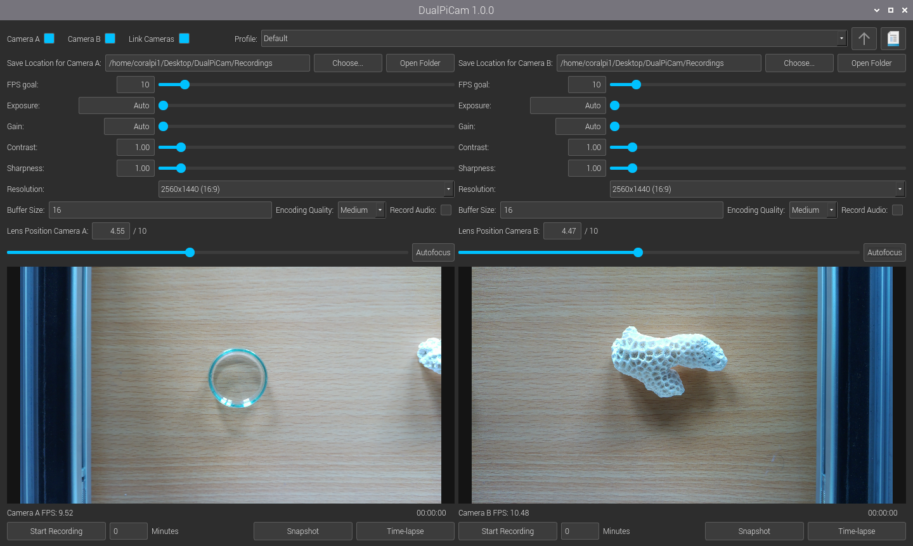

# DualPiCam

A PyQt5-based application for recording two Raspberry Pi camera streams in sync, with live previews and full per-camera controls. Snapshots and a simple time-lapse mode are included as extras.




> [!NOTE]
> **Disclaimer:** This project was completely vibe coded out of necessity for a tool that makes it easy to record two video streams in sync. I can't give any guarantee for the quality of the code, but on the setup listed below the program seems to work fine.

---

## Compatibility

| Component | Tested configuration |
|-----------|---------------------|
| Hardware  | Raspberry Pi 5 (8 GB RAM) |
| Cameras   | 2× [Raspberry Pi Camera Module 3](https://www.raspberrypi.com/products/camera-module-3/) |
| OS        | Raspberry Pi OS Bookworm (64-bit), Python 3.11 |
| picamera2 | 0.3.26 or newer |

**Tested stable frame rates with both cameras recording** (on the configuration above):

| Resolution | Stable FPS |
|------------|-----------------|
| 1920×1080 (1080p) | 30 |
| 2560×1440 (1440p) | 20 |
| 3840×2160 (2160p) | 10 |

You might be able to achieve higher framerates, especially at lower resolutions.

> **Note:** DualPiCam has only been tested on the hardware listed above. It may work on other Raspberry Pi models or with other cameras, but this is untested. Some features — in particular autofocus and manual lens position control — rely on hardware present in the Camera Module 3 and will not be available on cameras that do not support them.

---

## Features

**Dual-camera operation**
- Independent or synchronized (linked) control of two cameras
- Live OpenGL previews for both cameras side by side
- Per-camera FPS counter updated every second

**Video recording**
- H.264 encoding through picamera2 (software libav encoder on the Pi 5, which has no hardware H.264 block; hardware V4L2 encoding on Pi 4 and earlier)
- Frames are delivered as YUV420, the format the encoder works in, so no per-frame colour conversion is needed
- Optional audio track
- Duration-based auto-stop or infinite recording
- Elapsed | remaining time display during recording
- Editable save path per camera, plus an *Open Folder* button that shows the directory in the system file browser
- Metadata log file written alongside every recording (resolution, FPS, exposure, gain, contrast, sharpness, lens position, timestamps)

**Snapshots and time-lapse**
- Single-camera or synchronized dual-camera snapshots, available while not recording
- Time-lapse capture with an interval from 0.1 s to a year and an optional total duration; each session gets its own folder and a summary log

**Camera controls**
- FPS (1–120; the upper end is only reachable at low resolutions), editable via slider or text field. The frame duration is pinned to the chosen rate, so the preview shows the same exposure behaviour the recording will have
- Exposure: auto or manual (µs), range capped to 90 % of frame duration
- Analogue gain: auto or manual (0.00–16.00, 0.01 steps)
- Exposure and gain share libcamera's single auto-exposure switch: setting either one to a manual value turns auto-exposure off for both, and only with both back at Auto does the camera return to full auto
- Contrast and sharpness (0.00–16.00, 0.01 steps)
- 16 preset resolutions (640×360 to 4096×2304, including 4K and the maximum full-FOV preview resolution)
- Configurable DMA buffer count
- Five encoding quality presets (Very Low → Very High)
- Manual lens position (0.00–10.00) via slider or text box, and one-click autofocus
- Every slider has a matching text box, so values can be typed exactly instead of dragged

**Profile management**
- Save and load named camera configurations (JSON, stored in `Profiles/`)
- A `Default.txt` profile ships with the repository

---

## Hardware Setup

Connect the two Camera Module 3 cables to the **cam0** and **cam1** CSI ports on the Raspberry Pi 5.

Enable both cameras in `raspi-config` → *Interface Options* → *Camera*, or add the following to `/boot/firmware/config.txt`:

```
camera_auto_detect=1
```

Verify the cameras are detected before launching the app:

```bash
libcamera-hello --list-cameras
```

You should see Camera 0 and Camera 1 listed.

---

## Installation

### 1. Install system dependencies

This step uses the **Terminal**. On Raspberry Pi OS, open it from the taskbar or press **Ctrl + Alt + T**, paste the block below, and confirm with **Enter**. A standard Raspberry Pi OS Bookworm installation already has most of these libraries, so running it again does no harm:

```bash
sudo apt update
sudo apt install -y python3-pyqt5 python3-pyqt5.qtopengl \
    python3-picamera2 libcamera-apps \
    libavcodec-dev libavformat-dev libavutil-dev
```

### 2. Download and run

Pick whichever option suits you. Neither needs root privileges or any extra system configuration.

#### Option A — Terminal

Clone the repository and start the app:

```bash
git clone https://github.com/drefeld/DualPiCam.git
cd DualPiCam
python3 main.py
```

#### Option B — File manager

No git needed, minimal Terminal interaction required:

1. On the repository page, click the green **Code** button and choose **Download ZIP**.
2. Open your **Downloads** folder in the file manager, right-click the ZIP file (named something like `DualPiCam-main.zip`), and choose **Extract Here**.
3. Double-click the extracted `DualPiCam-…` folder to open it. You are in the right place when you can see `main.py`.
4. Press **F4**, or choose **Tools → Open Current Folder in Terminal**. A Terminal opens that is already inside this folder.
5. Type the following and press **Enter**:

   ```bash
   python3 main.py
   ```

To start the app again later, repeat steps 3–5.

### Updating

**If you installed with Option A**, open a Terminal and run:

```bash
cd ~/DualPiCam
git pull
```

This downloads only what has changed since your last update. The new version is used the next time you start the app. If you opened the Terminal from inside the folder, skip the `cd` line.

Git ignores your recordings and any profiles you saved yourself, so updating never touches them. The one exception is the shipped `Profiles/Default.txt`: if you saved over the *Default* profile and that file has also changed on GitHub, `git pull` stops with *"Your local changes … would be overwritten"*. To avoid this, keep your own settings in a profile with a different name. If it has already happened, save your settings under a new name, then run `git restore Profiles/Default.txt` (this discards your changes to that one file) and `git pull` again.

**If you installed with Option B**, the extracted folder has no connection to GitHub, so updating means downloading a fresh copy:

1. Rename the old folder, for example to `DualPiCam-old`.
2. Download and extract the new ZIP as described in Option B.
3. Copy anything you want to keep from the old folder into the new one — typically your own profiles in `Profiles`, and the `Recordings` folder if you used the default save location.

---

## Usage

### Basic workflow

1. Launch the app — both camera previews appear side by side.
2. Use the **camera control panels** (top section) to adjust FPS, exposure, gain, contrast, sharpness, resolution, and lens position for each camera. Each control can be dragged on its slider or typed into its text box.
3. Tick **Link Cameras** to keep both cameras in sync; any change on one side mirrors to the other.
4. Set a **save location** for each camera (defaults to `Recordings/` in the app directory). Type a path directly into the box, or pick one with *Choose…*. *Open Folder* opens the current directory in the file browser.
5. Press **Start Recording** to begin. A red dot appears next to the preview while recording is active.

### Save paths

The save-location box accepts either form:

- **A directory** — either an existing one, or any path typed with a trailing slash. Filenames are generated automatically (`<date>_cam<A|B>_<resolution>_<fps>fps.mp4`).
- **A directory plus a name** — e.g. `/home/pi/Videos/experiment1`. The last segment becomes a suffix on the generated filename, so recordings, snapshots, and time-lapse sessions from that camera are all tagged with it.

### Duration-based recording

Enter a number of minutes in the field next to the record button. The recording stops automatically when the time elapses. Set to `0` for infinite recording.

### Snapshots

Click **Snapshot** at any time while not recording. In linked mode, both cameras capture simultaneously.

### Time-lapse

Click **Time-lapse**, enter the capture interval in seconds and the total duration in minutes (0 = until stopped), and start. A blue dot and a status line show progress, and **Stop Time-lapse** ends the session early. Images and a summary log are saved to a new folder for each session.

### Profiles

- **Save**: click the save icon next to the profile dropdown and enter a name. Settings are written to `Profiles/<name>.txt` as JSON.
- **Load**: select a profile from the dropdown and click the load icon.

---

## Project Structure

```
DualPiCam/
├── main.py               # Entry point — creates QApplication and MainWindow
├── gui_main.py           # MainWindow: assembles UI, owns previews and timers
├── app_controller.py     # CameraManager: all business logic and camera operations
├── frame_processor.py    # RecordingWorker: one camera's H264 recording session
├── gui_components.py     # CameraControlsPanel, RecordingControlsPanel
├── camera_controls.py    # CameraControls (set_* wrappers), AutofocusHandler
├── camera_config.py      # Picamera2 init, stream format, configure helpers
├── utils.py              # App version and Qt widget factory helpers
├── requirements.txt      # Python dependencies (apt is preferred on Raspberry Pi OS)
├── Profiles/
│   └── Default.txt       # Default camera profile (JSON)
├── Recordings/           # Default output directory (created on first run)
└── LICENSE               # GNU General Public License v3
```

---

## Profile Format

Profiles are plain JSON files stored in the `Profiles/` directory with a `.txt` extension. Example:

```json
{
    "camera_a": {
        "fps": 10,
        "exposure": 0,
        "analog_gain": 0.0,
        "contrast": 1.0,
        "sharpness": 1.0,
        "lens_position": 4.88,
        "resolution_index": 13,
        "resolution_text": "2560x1440 (16:9)",
        "buffer_size": "16",
        "quality_index": 2,
        "audio_enabled": false
    },
    "camera_b": { ... },
    "created_at": "2025-04-27 10:51:47",
    "app_version": "1.0.0",
    "camera_a_enabled": true,
    "camera_b_enabled": true,
    "cameras_linked": true
}
```

| Field | Type | Notes |
|-------|------|-------|
| `fps` | int | 1–120 |
| `exposure` | int | Microseconds; 0 = auto |
| `analog_gain` | float | 0.0 = auto; 0.01–16.0 = manual |
| `contrast` | float | 0.0–16.0; 1.0 is neutral |
| `sharpness` | float | 0.0–16.0; 1.0 is neutral |
| `lens_position` | float | 0.0–10.0 (dioptres; 0.0 = focused at infinity) |
| `resolution_index` | int | Index into the 16-item resolution list |
| `resolution_text` | str | Human-readable resolution; used as a fallback if the index is out of range |
| `buffer_size` | str | DMA buffer count, 2–64 |
| `quality_index` | int | 0 = Very Low … 4 = Very High |
| `audio_enabled` | bool | |

Every value is stored as the number shown in the interface, not as an internal slider position, so profiles stay readable and hand-editable.

Out-of-range or malformed values are skipped with a message on the console rather than aborting the load. A profile written against a different resolution list still loads as long as `resolution_text` names a resolution that still exists.

---

## Performance Notes

A few deliberate choices, in case a future change makes them look arbitrary:

- **Stream format.** The main stream is `YUV420` (`MAIN_FORMAT` in `camera_config.py`). The Raspberry Pi 5 has no hardware H.264 encoder, so picamera2 encodes in software via libav, which works in `yuv420p`. Supplying `XRGB8888` instead makes libav colour-convert every frame of both cameras, and each buffer costs 4 bytes per pixel rather than 1.5 (14.1 MB vs 5.3 MB at 2560×1440). The OpenGL preview and JPEG snapshots both handle YUV420 natively. Change that one constant back to `"XRGB8888"` to revert.
- **Frame duration is pinned.** `FrameDurationLimits` is set to a single value derived from the FPS goal, for the preview as well as for recording. Auto-exposure therefore cannot stretch frames in dim light, so the preview shows what will actually be recorded.
- **No camera restart on Record.** Pressing *Start Recording* reconfigures the camera only if the requested resolution or buffer count differs from what is already running, which is normally not the case.
- **Everything camera-related runs on the Qt thread.** With a `QGlPicamera2` preview attached, picamera2 services `stop()` and `configure()` on the Qt event loop, so driving them from a background thread only makes them wait for the main thread. Snapshots and time-lapse captures still run in background threads and report back through Qt signals.

---

## Troubleshooting

**Both cameras show as a single device / only one camera detected**  
Check that `camera_auto_detect=1` is set in `/boot/firmware/config.txt` and that both CSI cables are fully seated.

**Preview is black or frozen**  
Run `libcamera-hello` in a terminal to verify the cameras work outside the app. If that also fails, the camera driver or cable is the issue.

**`ModuleNotFoundError: No module named 'picamera2'`**  
Install via `sudo apt install python3-picamera2` (preferred on Raspberry Pi OS) or `pip install picamera2` inside a virtual environment created with `--system-site-packages`.

**Recording drops frames**  
- Lower the resolution or target FPS, and stay within the tested limits listed under [Compatibility](#compatibility). The Pi 5 encodes H.264 in software, so two high-resolution streams are a real CPU load.
- Increase the buffer count (default 16; the field accepts 2–64). More buffers absorb longer stalls at the cost of memory.
- Use a fast SD card (UHS-I A2 class or better) or an SSD connected via USB 3.
- Close other applications; the encoder competes with them for CPU.

**Exposure or gain does not go back to Auto**  
Both must read `Auto` (slider fully left) before auto-exposure resumes — libcamera has a single switch for the pair, so one manual value keeps it off for both. Note also that picamera2 applies control changes on the next camera request, and a request already in flight can swallow one; DualPiCam re-sends every exposure/gain change once after a short delay to cover that. The auto-exposure algorithm then needs a few frames to re-converge, so give it a moment after switching back.

**Time-lapse produces fewer images than expected**  
Very short intervals can be faster than the camera can capture. Captures that would overlap are skipped, and the session log's `Average Interval` shows the rate actually achieved.

**`LIBCAMERA` errors on startup**  
These are usually informational and can be ignored. If the app crashes, verify the `libcamera` stack is up to date: `sudo apt upgrade libcamera-apps`.

---

## Dependencies

DualPiCam builds on the following open-source libraries:

| Library | License | Notes |
|---------|---------|-------|
| [PyQt5](https://www.riverbankcomputing.com/software/pyqt/) | GPL v3 | GUI framework by Riverbank Computing |
| [picamera2](https://github.com/raspberrypi/picamera2) | BSD 2-Clause | © 2021 Raspberry Pi Ltd |
| [PyAV](https://github.com/PyAV-Org/PyAV) | BSD 3-Clause | © PyAV contributors |

PyQt5 is used under its GPL v3 open-source licence, which is compatible with this project's GPL v3 licence.
The BSD-licenced libraries (picamera2, PyAV) permit use in GPL projects; their copyright notices are reproduced above as required by their licence terms.

---

## License

DualPiCam is free software: you can redistribute it and/or modify it under the terms of the **GNU General Public License v3** as published by the Free Software Foundation.

See [LICENSE](LICENSE) for the full license text.

**Copyright (C) 2025 David Brefeld**
